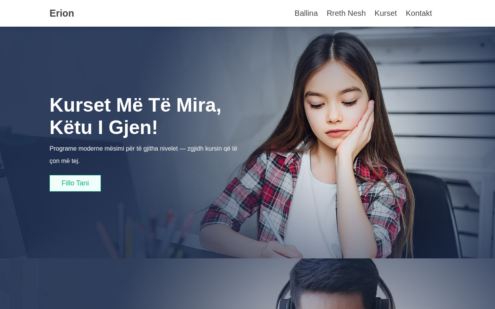

# Ecole-Website

Faqe interneti për shkollë/kurse — programe, lëndë, regjistrim dhe kontakt. E përshtatur plotësisht në **shqip**.

## Demo live

👉 https://erionnezha.github.io/Ecole-Website/

## Screenshot

## Përmbajtja

- **Ballina** (`index.html`) — hero slider, lëndët e njohura, kurset e njohura
- **Rreth Nesh** (`about.html`) — prezantimi i shkollës dhe pikat kryesore
- **Kurset** (`courses.html`) — 9 programe kursesh me buton "Shfaq më shumë"
- **Kontakt** (`contact.html`) — formulari i kontaktit, pyetjet e shpeshta (FAQ)

## Si hapet lokalisht

1. Shkarko ose klono repo-n
2. Hap `index.html` në shfletues — nuk kërkon server

(Kërkon lidhje interneti për CDN: Font Awesome dhe Swiper.)

## Teknologjitë

- HTML5
- CSS3
- JavaScript (vanilla)
- [Swiper](https://swiperjs.com/) — slider-at
- [Font Awesome](https://fontawesome.com/) — ikonat

## Kontakti

- Telefoni: +355 6XX XXX XXX
- Email: shembull@example.com
- Adresa: Tiranë, Shqipëri

## Licenca

MIT — shiko [LICENSE](LICENSE).

---

## English

School/courses website — programs, subjects, enrollment and contact. Fully localized in **Albanian**.

**Live demo:** https://erionnezha.github.io/Ecole-Website/

**Run locally:** open `index.html` in a browser (internet needed for Font Awesome + Swiper CDNs).

**Tech:** HTML5, CSS3, vanilla JavaScript, Swiper, Font Awesome.

**License:** MIT — see [LICENSE](LICENSE).
